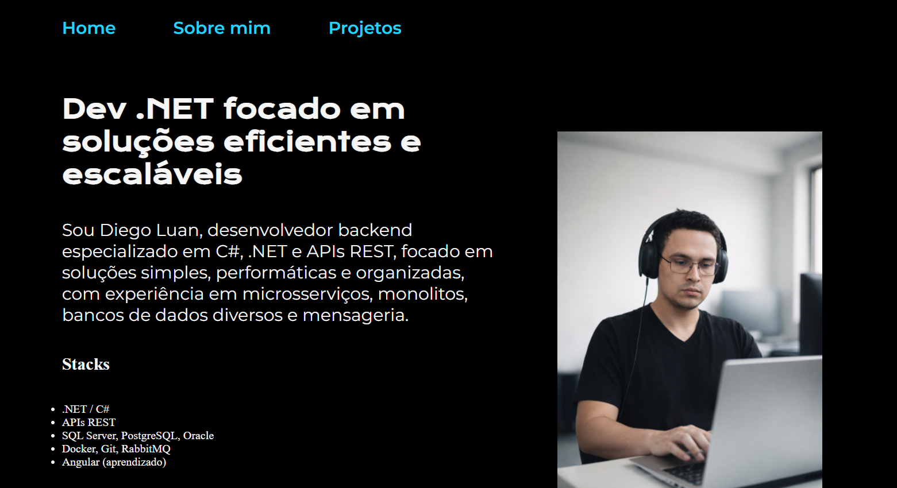

# Portfólio • Diego Luan

## Sobre o projeto

Este é o portfólio pessoal de Diego Luan, desenvolvedor backend especializado em C#, .NET e APIs REST. O objetivo é apresentar stacks, experiências e projetos de forma moderna, responsiva e objetiva.

- Foco em soluções simples, performáticas e organizadas
- Experiência com microsserviços, monolitos, bancos de dados relacionais e não-relacionais
- Interface responsiva e navegação mobile-friendly

## Stacks & Ferramentas

- .NET / C#
- APIs REST
- SQL Server, PostgreSQL, Oracle
- Docker, Git, RabbitMQ
- Angular (aprendizado)

## Como acessar

O portfólio está publicado em:

👉 [https://diegoluanfs.github.io/diegoluanfs/index.html](https://diegoluanfs.github.io/diegoluanfs/index.html)

## Projetos em destaque

- **Sistema Jurídico**: Plataforma para escritórios de advocacia com automações em .NET
- **Sistema Caridade**: Gestão de eventos, doações e cadastro social
- **Portfólio**: Página desenvolvida com HTML e CSS seguindo boas práticas de UI

## Contato

- [LinkedIn](https://www.linkedin.com/in/diego-luan/)
- [GitHub](https://github.com/diegoluanfs)
- [E-mail](mailto:diegoluanfs@gmail.com)

---

> Desenvolvido por Diego Luan
